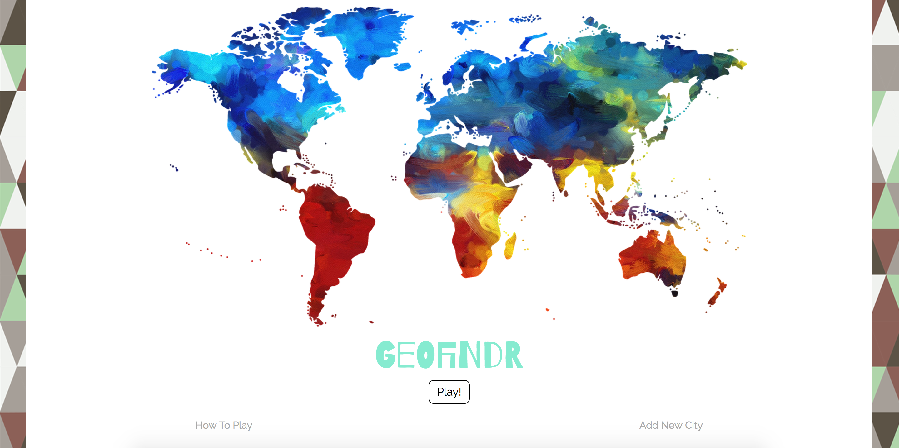
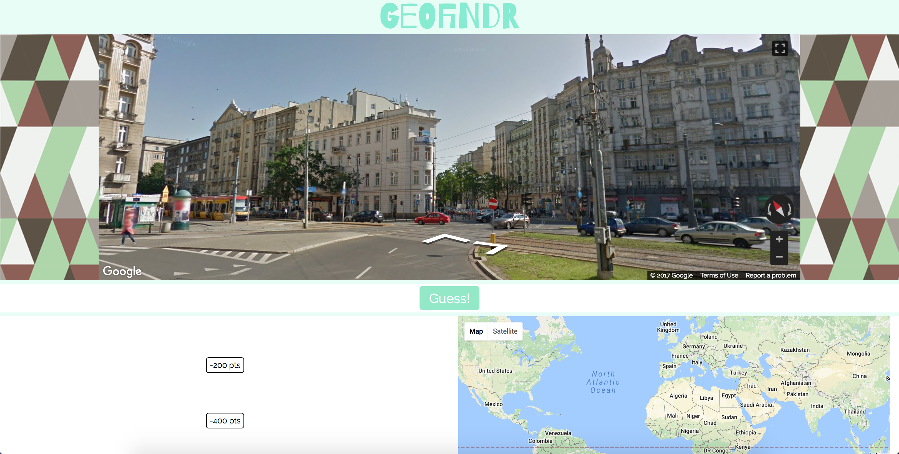

# Geofindr

This Geoguessr clone is provides a fun way to learn about the world around us.

## Instructions
1. The large map at the top shows a street view of a city located somewhere in the world. Your goal as the player is to guess this city!
2. Use the street view to pan the map and progress through the city streets and alleys to gather clues.
3. Unlock hints if your surroundings are not yielding any hunches.
4. Pin your guess on the world map on the bottom right and click submit.
5. The closer you are to the target city, the more points you will get.

## Technologies
* JavaScript
* React
* React Router
* Node (Express)
* PostgresQL + Knex.js

## Future Goals
1. Fine tune algorithm for calculating user score.
2. Redesign UI to fit on smaller screens.
3. Add more cities to the pool.
